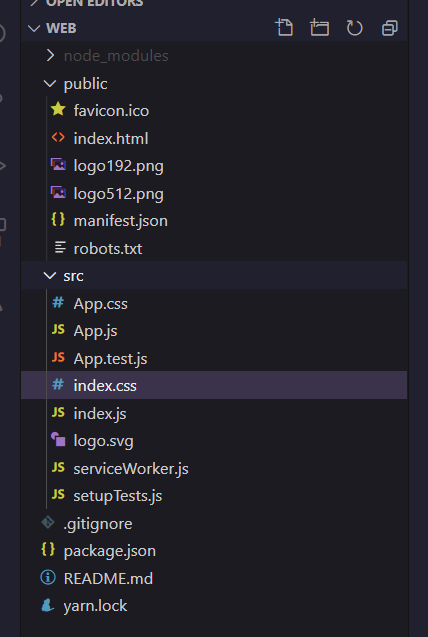

## How to create a React and React Native project
[](README.pt-br.md)

This tutorial does not have a detailed instruction on React and React Native. The purpose is to bring together the step-by-step and commands to create a project, fast and simplified.

I suggest reading the documentation for any technology you are going to use. At first it may seem complicated, but only with the documentation that you really learn deeply about.

#### Content that can help you on this journey
* [React Documentation](https://reactjs.org/docs/getting-started.html).

### Table of Contents
1. [Web (front-end)](#web)
2. [Server (back-end)](#server)
3. [Mobile using React Native](#mobile)
4. [How to run](#run)
5. [Contribution or Issues](#contribution)

### What you need to get started:
First, you need to install these tools:
* [Node.js](https://nodejs.org/en/)
* [NPM](https://www.npmjs.com/get-npm)
* [Yarn](https://yarnpkg.com/getting-started)
* [Expo](https://expo.io/learn)

## 🖥 Web (front-end) <a name="web"></a>
To create the web app you need to install the create-react-app. Use the following command in the terminal of your choice:
```
npm install -g create-react-app
```

Access the folder where you want to create your project and run the following command:

#### npx
```
npx create-react-app <project-name>
```
#### npm
```
npm init react-app <project-name>
```
#### Yarn
```
yarn create react-app <project-name>
```

### Using templates
You can now optionally start a new app from a template by appending --template [template-name] to the creation command.

#### npx
```
npx create-react-app <project-name> --template [template-name]
````
#### Yarn
```
yarn create react-app <project-name> --template [template-name]
````
(the project-name without the `<>` and template name without the `[]`)

My favorite code editor is Visual Studio Code, so to quickly open the folder I want to access, I access the folder through the terminal and use the command `code .` to open. Example:


The project structure will look like this:



I delete some files that I will not use:
* `App.css`
* `App.test.js`
* `index.css`
* `logo.svg`

The `servicerWorker.js` file is for working with PWA projects.

### Some definitions:
#### tsconfig.json
<!--Configurações do Typescript.-->
Typescript settings.

#### yarnlock
<!--Arquivo que armazena a versão de cada uma das dependências que está instalada no projeto. -->
File that stores the version of each of the dependencies that is installed in the project.

#### node_modules
<!--Pasta onde fica os códigos das dependências instaladas-->
Folder where the codes of the installed dependencies are located.


#### src
<!--`index.tsx` é o primeiro arquivo que o react carrega-->
`index(.tsx, .jsx, .js)` is the first file that React loads.

## ⌨️ Server (back-end) <a name="server"></a>
Access the folder where you want to create the server and run the following command:

```
mkdir server
```

Get into the folder `server` using the command `cd server` and use the yarn init command:

```
yarn init -y
```

Open the folder on Visual Studio Code using `code .`.

To complete the project configuration you need to install Typescript in the project. Use the following command:

```
yarn add typescript -D
```

and

```
yarn tsc --init 
```

In the `tsconfig.json `file, change the `"target": "es5"` to `"target": "es2017"`. You need to do this because it is until the 2017 version that has the features that Node.js recognizes.

Use the following [command](https://www.npmjs.com/package/ts-node-dev) to run the server and see if there are any changes to the script. This automates the process to get Node to understand Typescript.

```
yarn add ts-node-dev -D
```

The `-D` means that it will be used only in development mode and not in production.


## 📱 Mobile using React Native <a name="mobile"></a>
Use one of the following commands to create the mobile project:

```
expo init mobile
```

or

```
expo init mobile --template "blank"
```


## 🦾 Contribution or 🐞 Issues <a name="contribution"></a>
I wrote this little tutorial for the adventurous beginners on this study journey to React. This is for everybody so, if you have some improvements or suggestion, feel free to open a issue or contact me! I will happily review your pull request. 🥰


## 📃 License
Written with 💙 by [Luiza R. Marinho](https://github.com/luizous).

This tutorial is under [MIT License](LICENSE).
